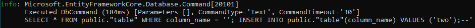

# Veracode False Negative Investigation

This is an application with a SQL injection flaw that is not being picked up by Veracode. This version of the application is built using .NET 6, but there is also a [.NET Core 3.1 version](https://github.com/PressXtoChris/FalseNegativeInvestigation/tree/netcore3.1) with the same problem.

The application starts in [the .Web project's Program.cs](./FalseNegativeInvestigation.Web/Program.cs). It calls `Console.ReadLine()` to read in an untrusted string, and then sends it to [the .Application project's Processor.cs](./FalseNegativeInvestigation.Application/Processor.cs), which then sends the string to [the .Infrastructure project's Repository.cs](./FalseNegativeInvestigation.Infrastructure/Repository.cs). The repository uses EntityFramework to execute a raw `SELECT` statement on a PostgreSQL database, using string interpolation to pass through the untrusted string. This allows the user to inject whatever SQL they would like.

If you would like to run the application on your local machine, you'll need a PostgreSQL database. You can spin one up easily using [Docker's official postgres:14 image](https://hub.docker.com/_/postgres). The application's connection string can be found in [the .Web project's appsettings.json](./FalseNegativeInvestigation.Web/appsettings.json) file. Then simply open the solution in Visual Studio, and start the .Web application.

Below is an example screenshot of running the application, and injecting the string `'; INSERT INTO public."table"(column_name) VALUES ('two');--`

